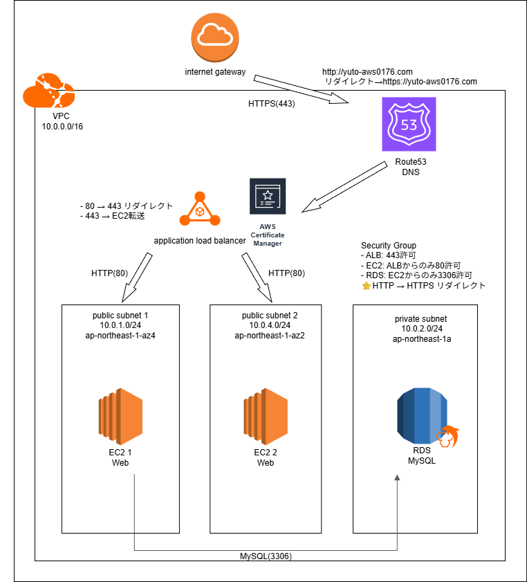

# aws-architecture

# AWS Route53 / ACM / HTTPS構築

## ■ 概要

AWS環境にて、VPC・EC2・RDS・ALBを用いた3層Webシステムを構築し、独自ドメイン設定およびHTTPS化まで実装しました。

## ■ 構成

* VPC
* EC2（Webサーバ）
* RDS（MySQL）
* ALB（ロードバランサ）
* Route53（DNS）
* ACM（SSL証明書）

## ■ 構成図

※編集用ファイルは architecture2.drawio を参照

## ■ 工夫点

* セキュリティ

  * EC2を直接インターネット公開せず、ALB経由でアクセス
  * RDSはプライベートサブネットに配置
  * HTTPS通信（SSL証明書による暗号化）

* 可用性

  * ALBを使用し、複数AZに対応

* ネットワーク設計

  * パブリックサブネットとプライベートサブネットを分離

## ■ 学んだこと

* VPC設計（CIDR、サブネット分割）
* セキュリティグループの設定
* Route53によるDNS管理
* ACMによるSSL証明書の発行
* HTTPS通信の仕組み

## ■ 今後の改善

* EC2のプライベートサブネット配置
* NAT Gatewayの導入
